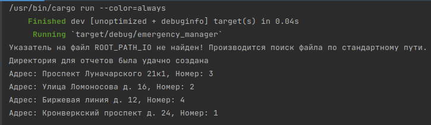

# Rust Emergency Manager
Демонстративная программа, использующая некоторые функции языка Rust 
и его модулей по обеспечению асинхронности выполнения задач.
---

## Предназначение
Реализован модуль emergency_async, содержащий функцию 
`сall_911(&String, Vec<String>, Option<usize>)`, которая симулирует работу
диспетчера службы экстренного реагирования - фиксирует вызовы и
данные о них в отдельные файлы с информацией об адресе, номере вызова и времени его обслуживания.

## Сборка
```shell
    cargo build
```

## Запуск
По умолчанию директория с отчетами по работу будут созданы
по пути `/home/mike/rust`, потому что мне было так удобнее)
Если вас устаивает подобное расположение отчетов, тогда запустить
можно командой:
```shell
    cargo run
```
Если же требуется установка иной директории требуется вместе с запуском
указать переменную окружения ROOT_PATH_IO с адресом целевой директории.
Пример для создания директории по текущему пути:
```shell
    export ROOT_PATH_IO=$(pwd) && cargo run
```

## Конфигурация
В случае необходимости разрешено изменение конфигурации программы в main.rs
**(Внимание: требуется пересборка)**:
+ *DIR_NAME* - Название директории для отчетов
+ *DEFAULT_PATH* - Целевая директория "по умолчанию"
+ *BRIGADES_COUNT* - Количество вызовов, которые могут обрабатываться одновременно

## Пример работы
Демонстрационный вывод в консоль:

Демонстрационный вывод в отчёт:


---
### Автор
Михамл Степанов\
**email:** timetocook420@gmail.com\
**telegram:** @timetocook420

